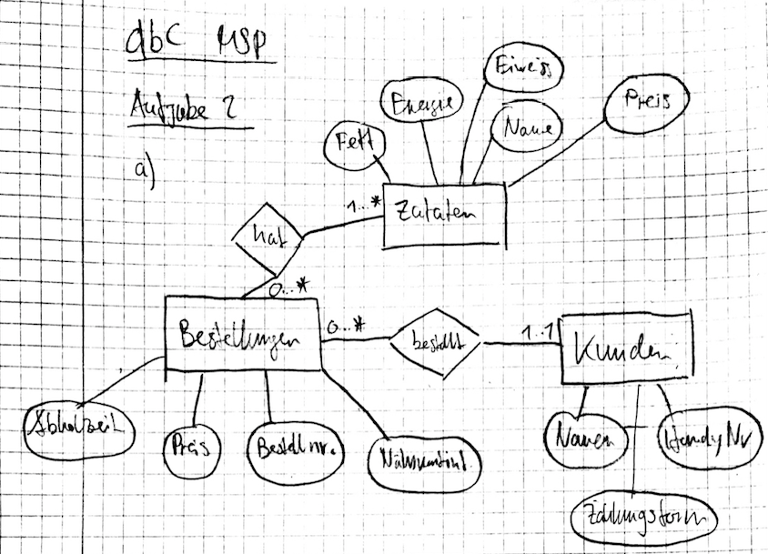
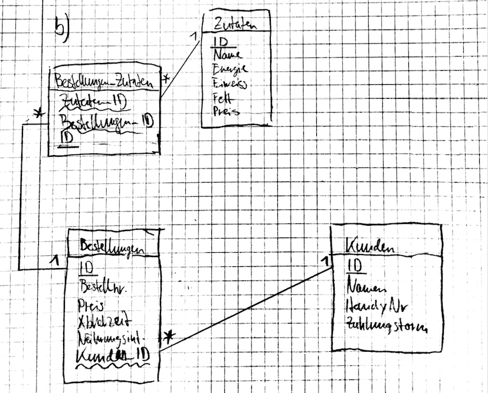

# dbC MSP Lösung - Aufgabe 2

## a) Konzeptionelles Datenmodell


## b) Relationales Datenmodell


## c) SQL DDL
```sql

CREATE TABLE Zutaten (
  id int(11) NOT NULL PRIMARY KEY AUTO_INCREMENT,
  name varchar(200) NOT NULL,
  energie varchar(200) NOT NULL,
  eiweiss varchar(200) NOT NULL,
  fett varchar(200) NOT NULL,
  preis float NOT NULL
);

CREATE TABLE Kunden (
  id int(11) NOT NULL PRIMARY KEY AUTO_INCREMENT,
  name varchar(200) NOT NULL,
  handynr varchar(200) NOT NULL,
  zahlungsform varchar(200) NOT NULL
);

CREATE TABLE Bestellungen (
  id int(11) NOT NULL PRIMARY KEY AUTO_INCREMENT,
  bestellnummer varchar(200) NOT NULL,
  preis float NOT NULL,
  abholzeit date NOT NULL,
  naehrwertinformation text NOT NULL,
  kunden_id int NOT NULL,
  FOREIGN KEY (kunden_id) REFERENCES Kunden(id)
);

CREATE TABLE Bestellungen_Zutaten (
  id int(11) NOT NULL PRIMARY KEY auto_increment,
  bestellungen_id int NOT NULL,
  zutaten_id int NOT NULL,
  -- add a constrain with cascading to remove all foreignkeys to Bestellungen
  CONSTRAINT fk_bestellungen_id
  FOREIGN KEY (bestellungen_id) REFERENCES Bestellungen(id)
  ON DELETE CASCADE,
  FOREIGN KEY (zutaten_id) REFERENCES Zutaten(id)
);
```

## d) SQL QL

```sql
-- make delete possible
SET SQL_SAFE_UPDATES = 0;

-- i.
-- Ein Kunde mit der Handynummer 077 445 83 97 löscht all seine Bestellungem die Tomaten als Zutate haben.

DELETE b FROM bestellungen b
INNER JOIN Kunden k ON b.kunden_id = k.id
INNER JOIN Bestellungen_Zutaten bz ON b.id = bz.bestellungen_id
INNER JOIN Zutaten z ON bz.zutaten_id = z.id
WHERE k.handynr = "077 445 83 97"
AND z.name = "Tomate";

-- ii. Schreiben Sie einen SQL-Ausdruck, welcher den Totalpreis aller Bestellungen aller Kunden in der Datenbank ausgibt.

SELECT k.name , SUM(b.preis) from Bestellungen b
INNER JOIN Kunden k ON k.id = b.kunden_id
-- WHERE k.id = b.kunden_id
GROUP BY k.name;

-- iii.
-- Schreiben Sie einen SQL-Ausdruck, welcher aufzeigt, welche Zutaten am beliebtesten (= am häufigsten bestellt) sind.

SELECT z.name, COUNT(bz.zutaten_id) AS beliebtheit from Zutaten z
INNER JOIN Bestellungen_Zutaten bz ON z.id = bz.zutaten_id
-- WHERE z.id = bz.zutaten_id
GROUP BY z.name
ORDER BY beliebtheit DESC;
```
